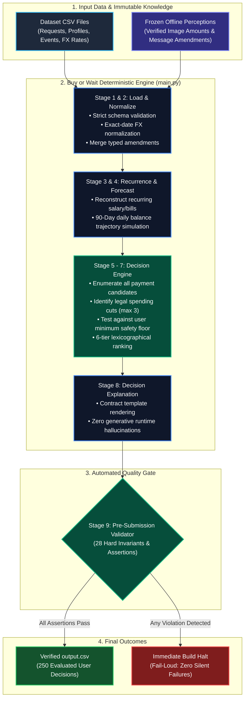

# Big Picture: System Architecture & Data Flow

This document provides an executive and stakeholder-friendly overview of the **Buy or Wait** financial affordability engine: how it works end-to-end, what guarantees its mathematical accuracy, and the operational risks to understand.

---

## 1. System Architecture Diagram

---

## 2. How the Application Flows

The engine answers a single critical financial question for 250 evaluation requests: **"Can the user safely afford this purchase, and if so, how and when?"**

1. **System Ingestion (`main.py` ➔ Load & Normalize)**:
   - Reads historical transactions, user financial profiles, purchase requests, and currency exchange rates.
   - Merges verified offline perception data (receipt OCR numbers and parsed message amendments) without making any live AI calls.
   - Normalizes all foreign currency transactions into the user's home currency using exact-day rates.

2. **90-Day Forward Balance Simulation (Recurrence & Forecast)**:
   - Reconstructs regular income and recurring obligations (salaries, subscriptions, rent) from historical transaction patterns.
   - Projects a day-by-day cash balance curve from `request_date` through `request_date + 90 days`.

3. **Exhaustive Decision Search (Planner & Safety Testing)**:
   - Generates all potential options: paying in full today, utilizing installment plans, partial payment, or waiting for a future date.
   - Evaluates whether up to 3 legal discretionary spending cuts (e.g. dining, entertainment) can safely unlock the purchase.
   - Tests every candidate option against the user's strict financial safety buffer (`minimum_balance_to_keep`).

4. **Transparent Ranking & Explanation**:
   - Selects the single best option using a 6-tier rulebook prioritizing financial safety and minimal lifestyle disruption.
   - Generates clear, auditable explanations using fixed contractual templates.

5. **Fail-Loud Verification Gate**:
   - Before any output is written to disk, an automated validator checks 28 mathematical and contractual invariants across all 250 rows.
   - If even a single assertion fails, execution stops immediately to prevent faulty financial advice from reaching production.

---

## 3. Why the Engine is Accurate

- **Zero Runtime AI Hallucinations**: Scoring is 100% deterministic Python. Language models were quarantined to offline extraction; during live scoring, zero external API calls are made.
- **Strict Decimal Mathematics**: All calculations use Python `Decimal` with fixed rounding. Floating-point approximations (which introduce micro-penny drift) are prohibited.
- **Exact-Date Foreign Exchange**: No rate interpolation or guesswork. Every cross-currency transaction maps to an exact-date historical exchange rate.
- **Candidate Exhaustion**: Rather than guessing a single recommendation, the engine systematically tests all possible permutations before selecting the optimal strategy.

---

## 4. Operational Risks and Limitations

| Risk Area | Description | Business Impact / Mitigation |
|---|---|---|
| **Recurrence Assumption** | The engine assumes historical income and expense cadences continue over the next 90 days. | Sudden life changes or unannounced salary delays cannot be anticipated unless communicated via user messages. |
| **90-Day Horizon Cliff** | The evaluation window ends strictly at Day 90. | An installment plan that is safe through Day 90 might face liquidity stress on Day 95. Financing that spans past 90 days carries longer-term exposure. |
| **User Behavioral Adherence** | Recommendations requiring spending reductions assume the user will actually reduce discretionary expenses. | In practice, behavioral compliance may vary; the engine clearly highlights the exact dollar amounts the user must cut. |
| **Phantom Liquidity Protection** | The engine strictly protects the user's balance buffer (`minimum_balance_to_keep`). | While conservative, this prevents accidental overdrafts and debt spirals at the cost of declining borderline purchases. |
