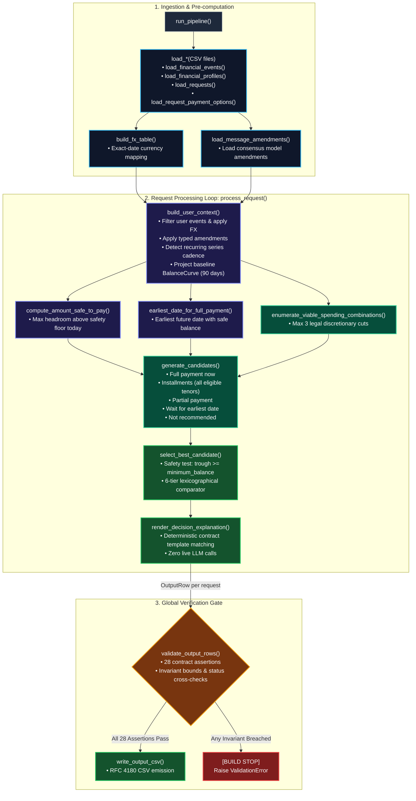

# Engine Process & Critical Function Flow

This document details the internal process flow of the **Buy or Wait** engine for technical stakeholders. It focuses on the core pipeline functions, data transformations, decision gates, and failure-mode protections.

---

## 1. Critical Function & Process Flow Diagram

---

## 2. Technical Process Description

### Step 1: Ingestion & Normalization
- **`load_*()` & Schema Gate**: Ingests the 9 source datasets into immutable, type-checked Python dataclasses. Image amounts extracted offline are merged into financial events with zero missing-value tolerance.
- **`build_fx_table()`**: Constructs directed, exact-date foreign exchange lookup tables. If a transaction currency does not match the user's home currency on that exact day, missing rates trigger an immediate exception rather than defaulting or interpolating.
- **`load_message_amendments()`**: Loads the offline audited consensus amendments (such as salary adjustments or cancelled recurring subscriptions).

### Step 2: Context Building & Trajectory Projection (`build_user_context`)
- Filters transactions for the specific `user_id` and applies foreign exchange conversion and confirmed amendments.
- **`resolve_user_recurrence()`**: Detects recurring income and expense patterns using transaction description, category, and modal date intervals (minimum 3 occurrences).
- **`project()`**: Calculates a daily 90-day cash curve:
  $$\text{Balance}_{d} = \text{Opening Balance} + \sum (\text{Credits} - \text{Debits})$$
  Balance values are strictly derived from daily cash flows rather than stored statically.

### Step 3: Capacity & Date Analysis
- **`compute_amount_safe_to_pay()`**: Determines the maximum amount the user can spend on the purchase date without allowing the projected 90-day balance curve to dip below their `minimum_balance_to_keep`.
- **`earliest_date_for_full_payment()`**: Scans all 91 days in the window to find the earliest calendar date on which paying the full purchase price maintains a safe balance floor.

### Step 4: Candidate Search Space & Spending Optimization
- **`enumerate_viable_spending_combinations()`**: Evaluates the user's willingness and ability to reduce discretionary expenses (e.g., dining, subscriptions). Under contract rules, a maximum of 3 distinct spending adjustments may be recommended.
- **`generate_candidates()`**: Combines every available financing mechanism (paying in full, all vendor-offered installment plans, partial payment, waiting, and declining) with and without viable spending reductions.

### Step 5: Multi-Tier Lexicographical Ranking (`select_best_candidate`)
- **Safety Testing**: Discards any plan where projected trough balance falls below `minimum_balance_to_keep`.
- **6-Tier Comparator**:
  1. **Affordability Tier**: Prefers affordable now > affordable with changes > wait > not recommended.
  2. **Payment Method Preference**: Prioritizes user payment preferences (full payment vs installments).
  3. **Lifestyle Preservation**: Minimizes the number and dollar magnitude of required spending reductions.
  4. **Completion Timing**: Prefers plans that complete closest to or before the user's desired date.
  5. **Interest & Fee Minimization**: Selects installment options with the lowest total borrowing cost.
  6. **Cash Cushion Preservation**: Selects the candidate that leaves the highest minimum liquidity trough.

### Step 6: Deterministic Explanation & Pre-Submission Gate
- **`render_decision_explanation()`**: Fills 7 certified template structures using exact numeric and date outputs.
- **`validate_output_rows()`**: Evaluates 28 contract assertions covering value ranges, status compatibility, date logic, and RFC 4180 formatting. If any assertion fails, execution stops immediately before writing `output.csv`.

---

## 3. Key Technical Safeguards

- **Phantom Liquidity Prevention**: Recurring events are only projected if proven by at least 3 occurrences. Irregular or one-off income is excluded to prevent false confidence.
- **No Float Arithmetic**: All financial calculations use Python's `Decimal` type to prevent binary floating-point rounding inaccuracies.
- **Fail-Loud Architecture**: No silent defaults. Missing foreign exchange rates, null image amounts, or schema mismatches raise immediate errors.
- **Zero API Dependency at Runtime**: The entire 250-request evaluation runs in under 4 seconds on local CPU with zero network dependency.
